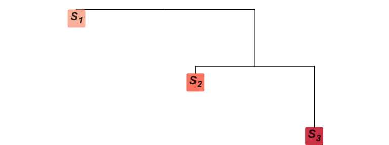
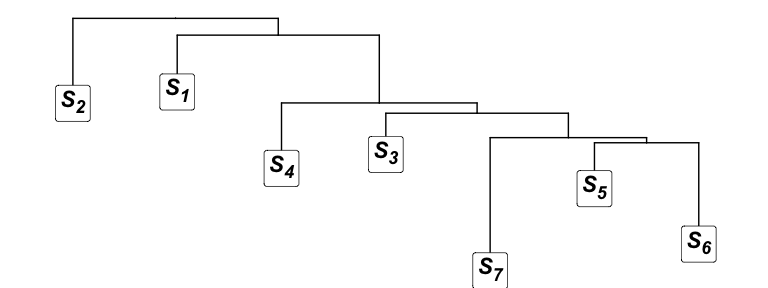
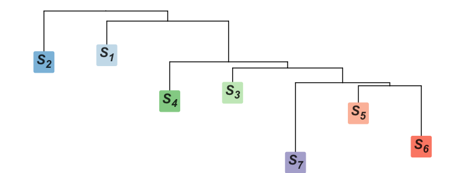

\providecommand{\bA}{\boldsymbol{A}}
\providecommand{\bB}{\boldsymbol{B}}
\providecommand{\bD}{\boldsymbol{D}}
\providecommand{\bF}{\boldsymbol{F}}
\providecommand{\bG}{\boldsymbol{G}}
\providecommand{\bI}{\boldsymbol{I}}
\providecommand{\bJ}{\boldsymbol{J}}
\providecommand{\bK}{\boldsymbol{K}}
\providecommand{\bM}{\boldsymbol{M}}
\providecommand{\bP}{\boldsymbol{P}}
\providecommand{\bQ}{\boldsymbol{Q}}
\providecommand{\bR}{\boldsymbol{R}}
\providecommand{\bU}{\boldsymbol{U}}
\providecommand{\bV}{\boldsymbol{V}}
\providecommand{\bW}{\boldsymbol{W}}
\providecommand{\bX}{\boldsymbol{X}}
\providecommand{\bZ}{\boldsymbol{Z}}

\providecommand{\ba}{\boldsymbol{a}}
\providecommand{\bp}{\boldsymbol{p}}
\providecommand{\bu}{\boldsymbol{u}}
\providecommand{\bv}{\boldsymbol{v}}
\providecommand{\bw}{\boldsymbol{w}}
\providecommand{\bx}{\boldsymbol{x}}
\providecommand{\by}{\boldsymbol{y}}
\providecommand{\bz}{\boldsymbol{z}}
\providecommand{\argmin}{\arg\min}

\providecommand{\ba}{\boldsymbol{\alpha}}
\providecommand{\bb}{\boldsymbol{\beta}}
\providecommand{\bth}{\boldsymbol{\theta}}
\providecommand{\beps}{\boldsymbol{\epsilon}}
\providecommand{\bSigma}{\boldsymbol{\Sigma}}
\providecommand{\bGamma}{\boldsymbol{\Gamma}}
\providecommand{\bTheta}{\boldsymbol{\Theta}}
\providecommand{\bLambda}{\boldsymbol{\Lambda}}

\providecommand{\expect}{\mathbb{E}}
\providecommand{\cov}{\mathbb{C}}
\providecommand{\var}{\text{Var}}
\providecommand{\prob}{\mathbb{P}}
\providecommand{\indicator}{\mathds{1}}
\providecommand{\multinorm}{\mathcal{N}}
\providecommand{\tr}{\text{tr}}
\providecommand{\prox}{\text{prox}}
\providecommand{\dist}{\text{dist}}
\providecommand{\proj}{\mathcal{P}}
\providecommand{\projsplx}{\mathcal{P}_{\Delta}}
\providecommand{\real}{\mathbb{R}}
\providecommand{\dom}{\text{dom}}
\providecommand{\compact}{\mathcal{C}}
\providecommand{\fst}{F_{\text{ST}}}


\providecommand{\bn}{\text{BN}}
\providecommand{\unif}{\text{Uniform}}
\providecommand{\dirichlet}{\text{Dirichlet}}
\providecommand{\bino}{\text{Binom}}
\providecommand{\norm}{\mathcal{N}}

\providecommand{\bO}{\boldsymbol{0}}
\providecommand{\bone}{\boldsymbol{1}}

\providecommand{\indcoan}{\boldsymbol{\Theta}}
\providecommand{\popcoan}{\boldsymbol{\Lambda}}
\providecommand{\kinship}{\boldsymbol{\Phi}}

\providecommand{\popcoanuv}{\lambda_{uv}}
\providecommand{\indcoanjk}{\theta_{jk}}

\providecommand{\hatkinos}{\hat{\boldsymbol{\Theta}}^{\text{OS}}}

\providecommand{\hatpopcoanstd}{\hat{\boldsymbol{\Lambda}}^{\text{std}}}
\providecommand{\hatpopcoansup}{\hat{\boldsymbol{\Lambda}}^{\text{sup}}}

\providecommand{\hatindcoanstd}{\hat{\boldsymbol{\Theta}}^{\text{std}}}
\providecommand{\hatindcoansup}{\hat{\boldsymbol{\Theta}}^{\text{sup}}}
\providecommand{\hatindcoanos}{\hat{\boldsymbol{\Theta}}^{\text{OS}}}

\providecommand{\hatpopcoanstduv}{\hat{\lambda}_{uv}^{\text{std}}}
\providecommand{\hatpopcoansupuv}{\hat{\lambda}_{uv}^{\text{sup}}}

\providecommand{\hatindcoanstdjk}{\hat{\theta}_{jk}^{\text{std}}}
\providecommand{\hatindcoansupjk}{\hat{\theta}_{jk}^{\text{sup}}}
\providecommand{\hatindcoanosjk}{\hat{\theta}_{jk}^{\text{OS}}}

\providecommand{\bootpopcoanstd}{\hat{\boldsymbol{\Lambda}}^{\text{*,std}}}
\providecommand{\bootpopcoansup}{\hat{\boldsymbol{\Lambda}}^{\text{*,sup}}}

\providecommand{\E}{\mathbb{E}}
\providecommand{\C}{\mathbb{C}}
\providecommand{\V}{\mathbb{V}}


```{r, include = FALSE}
knitr::opts_chunk$set(
  collapse = TRUE,
  comment = "#>"
)
```

```{r status, echo=FALSE}
fast_run <- FALSE
```

This document explains how to employ our `superadmixture` package to  human genotypes dataset.
In the section **Theory**, we provide a short summary of super admixture framework. 
In the section **Analysis of AMR subset of 1000 Genomes**, we demonstrate how to analyze AMR subset of 1000 Genomes by our package.
In the section **Analysis of HGDP**, we demonstrate how to analyze HGDP dataset. A reader primarily interested in a basic 
understanding of the operational procedure of `superadmixture` package may proceed to **Analysis of AMR subset of 1000 Genomes** and **Analysis of HGDP**.
  
  
# Background

The following is a summary of the theory, models, and estimates used in this package. The user can check the paper [here](https://doi.org/10.1101/2024.12.29.630632) for full details.

## Models

We assume that $m$ SNPs are measured on $n$ individuals. The genotype measurements are denoted by $x_{ij}$ for $i = 1, \ldots, m$ and $j = 1, \ldots, n$. We assume that $\E[x_{ij} | \pi_{ij}] = 2 \pi_{ij}$ for where $\pi_{ij}$ denotes individual specific allele frequency (IAF). This IAF parameterization allows each individual-SNP pair to possibly have a distinct allele frequency. The classical scenario where there is one allele frequency per SNP is a special case where $\pi_{i1} = \pi_{i2} = \cdots = \pi_{in}$. 

### The coancestry model 

The coancestry model assumes IAFs are random parameters with respect to some ancestral population $T$. This is a neutral model where 
\begin{align}
& \E[\pi_{ij} | T] = a_i \label{eq: aaf} \\
& \C[\pi_{ij}, \pi_{ik} | T] = a_i (1- a_i) \theta_{jk} \label{eq:coviaf}
\end{align} 
for $i = 1, \ldots, m$ and $j, k = 1, \ldots, n$.The parameter $a_i$ is the ancestral allele frequency in $T$ for SNP $i$ and $0 \leq \theta_{jk} \leq 1$ is the coancestry for individuals $j$ and $k$ with respect to $T$. 

### The admixture model 

We first describe a general formulation of the admixture model, of which standard and super admixture are special cases. There are $K$ populations $S_1, S_2, \ldots, S_K$ descended from $T$ that precede the present day population, which we refer to as *antecedent populations*. While $T$ has allele frequencies $a_1, a_2, \ldots, a_m$, antecedent population $S_u$ has allele frequencies $p_{1u}, p_{2u}, \ldots, p_{mu}$ for $u = 1, 2, \ldots, K$. The allele frequencies $\{p_{iu}\}$ are random parameters from a distribution parameterized by $\{a_{i}\}$ plus other possible parameters that characterize the evolutionary process from $T$ to $S_u$. Moreover, IAFs $\{\pi_{ij}\}$ are weighted averages of $\{p_{iu}\}$:
\begin{equation}
\pi_{ij} = \sum_{u=1}^K p_{iu} q_{uj}.
\end{equation}
where $\{q_{uj}\}$ are admixture proportions, where $0 \leq q_{uj} \leq 1$ and $\sum_{u=1}^K q_{uj} = 1$.

#### Standard admixture 

We define the standard admixture model to be the case where the antecedent allele frequencies are independently distributed. 
\begin{align*}
& \text{Standard Admixture:} \\
& p_{i1}, p_{i2}, \ldots, p_{iK} \text{ are jointly independent} \\
& \E[ p_{iu} | T ] = a_i \\
& \V[p_{iu} | T ] = a_i (1-a_i) f_u 
\end{align*}
Under this parameterization, $f_u$ is the inbreeding coefficient or $F_{\text{ST}}$ of antecedent population $S_u$ with respect to $T$. Since the $\{ p_{iu} \}$ are jointly independent, there is no coancestry among antecedent populations and there is no dependence among loci. 

#### Super admixture

The super admixture model extends the standard admixture model in that it includes a covariance among antecedent population allele frequencies, which we refer to as population-level coancestry. 
\begin{align}
& \text{Super Admixture:} \nonumber \\
& p_{i1}, p_{i2}, \ldots, p_{iK} \text{ are jointly dependent} \nonumber \\
& \E[ p_{iu} | T ] = a_i \label{eqn:superadmix_popcoan} \\
& \V[p_{iu} | T ] = a_i (1-a_i) \lambda_{uu} \nonumber \\
& \C[p_{iu}, p_{iv} | T ] = a_i (1-a_i) \lambda_{uv} \nonumber 
\end{align}
Under this parameterization, the population-level coancestry is denoted by $\lambda_{uv}$ for $u, v = 1, 2, \ldots, K$ where $0 \leq \lambda_{uv} \leq 1$.

## Estimation

The package estimates $\{\lambda_{uv}\}$ by proximal forward-backward (PFB) algorithm ([details here](https://doi.org/10.1101/2024.12.29.630632)), estimates $\{p_{iu}\}$ and $\{q_{uj}\}$ by ALStructure algorithm ([details here](https://doi.org/10.1534/genetics.119.302159)), simulates $\{x_{ij}\}$ by the double-admixture algorithm ([details here](https://doi.org/10.1101/2024.12.29.630632)), and selects the number of antecedent populations $K$ by sHWE method ([details here](https://doi.org/10.1534/genetics.119.302370)). 

# Analysis of AMR subset of 1000 Genomes 

## Estimating coancestry among individuals

```{r load_amr}
data("X_amr",   package = "superadmixture")
data("fam_amr", package = "superadmixture")
```

Since the number of loci of the AMR subset of 1000 Genomes dataset is too large for a quick analysis, we created a subset of this dataset by first applying allele frequency filters and LD-pruning to the AMR dataset. We then randomly selected 10,000 SNPs out of LD-pruned SNP sets. We also re-ordered individuals according to their pairwise kinship level. This subset is available in `data/X_amr.rda`. This data has `r nrow(X_amr)` individuals and `r ncol(X_amr)` loci. The associated fam file can be found in `data/fam_amr.rda`. These data can be reproduced by scripts `data-raw/{amr.bash,amr.R}`. 

We adopt the `popkin` package to obtain the Ochoa-Storey (OS) estimate of coancestry among individuals. The following chunk of the code estimates the individual-level coancestry $\hat{\boldsymbol{\Theta}}^{\text{OS}}$ according to the Ochoa-Storey (OS) method by `popkin` package. It should noted that the `popkin` function returns the kinship coefficients instead of the coancestry coefficients. Therefore, we use the `inbr_diag` function in the `popkin` package to map kinship coefficients $\phi_{jk}$'s to coancestry coefficients $\theta_{jk}$'s:

\[
\theta_{jk} = 
\begin{cases}
2\phi_{jk} - 1 & j = k \\
\phi_{jk} &j \neq k
\end{cases}.
\]

```{r estimate_coanc_indiv_amr, eval=!fast_run, message=FALSE, warning=FALSE}
# load popkin package
library(popkin)

# estimate kinship coefficients
# `popkin` function requires a m (number of loci) x n (number of individuals) as input, so we transpose the `X_amr` first 
kinship <- popkin(t(X_amr)) 

# map kinship coefficients to coancestry coefficients
coanc_indiv <- inbr_diag(kinship)

# kinship coefficients and coancestry coefficients are probability, 
# so we truncate at zero to avoid negative probability
coanc_indiv <- ifelse(coanc_indiv < 0, 0, coanc_indiv)
```

We can visualize the estimated individual-level coancestry by utilizing the `plot_popkin` function in the `popkin` package. To create the sub-population labels, we define the following helper functions `plot_colors_subpops` and `legend_color_categories`.

```{r helper_functions, eval=TRUE, warning=FALSE, message=FALSE}
plot_colors_subpops <- function(colors, y = FALSE) {
  # number of individuals
  n <- length(colors)
  if (y) {
    x <- rbind(n: 1)
  } else {
    x <- cbind(1: n)
  }
  image(x, col = colors, axes = FALSE, useRaster = TRUE)
}

# We also need to construct a legend for these colors.
legend_color_categories <- function(colors, categories, label, cex_label = 1) {
  x <- 1: length(colors)
  image(y = x, z = rbind(x), col = colors, xaxt = "n", yaxt = "n")
  axis(4, at = x, labels = categories, tick = FALSE)
  mtext(side = 4, label, line = 2, cex = cex_label)
}
```

```{r plot_coanc_indiv_os_amr, eval=TRUE, warning=FALSE, message=FALSE, fig.width=6, fig.height=5.3, fig.align='center'}
# We plot the individual-level coancestry 
subpop_order <- c('PUR', 'CLM', 'PEL', 'MXL')
n_subpops      <- length(subpop_order)
colors_subpops <- RColorBrewer::brewer.pal(n_subpops, "Set3")
fam_amr$col    <- colors_subpops[match(fam_amr$fam, subpop_order)]

par(mar = c(0, 0, 1, 0) + 0.2)

layout(rbind(c(3, 1, 2), c(3, 1, 5), c(0, 4, 0)), widths  = c(0.05,   1,  0.2), heights = c(0.5,  0.5, 0.07))

popkin::plot_popkin(kinship = coanc_indiv, layout_add = FALSE, ylab = '', leg_title = "Coancestry", titles = c("OS individual coancestry"))

plot_colors_subpops(fam_amr$col, y = TRUE)

mtext('Individuals', side = 2, line = 0.5, xpd = NA, cex = 0.8)

plot_colors_subpops(fam_amr$col)

par(mar = c(0, 0, 0, 3) + 0.2)
legend_color_categories(colors = colors_subpops, categories = subpop_order, label = 'Subpopulation', cex_label = 0.8)
```

## Estimating admixture proportions and coancestry among antecedent populations

The following chunk of the code estimates the admixture proportions $\bQ$ from genotypes. We first estimate the individual specific allele frequencies $\boldsymbol{\Pi}$ using the `est_p_indiv` function in the `superadmixture` package. We then estimate $\bQ$ by decomposing $\boldsymbol{\Pi}$ with `factor_p_indiv` function in the `superadmixture` package. 

```{r estimate_admix_props_amr, eval=!fast_run, message=FALSE, warning=FALSE}
library(superadmixture)

# estimate individual-specific allele frequencies
obj <- est_p_indiv(X_amr, k_antepops = 3, loci_on_cols = TRUE)
p_indiv  <- obj$p_indiv
rowspace <- obj$rowspace

# estimate P and Q by decomposing individual-specific allele frequencies
obj <- factor_p_indiv(p_indiv, k_antepops = 3, rowspace = rowspace, verbose = FALSE, max_iters = 200, tol = 1e-2)
Q_hat <- obj$Q_hat
```

After obtaining individual-level coancestry `coanc_indiv` and admixture proportions `Q_hat`, we can use the function `est_coanc` to estimate population coancestry $\boldsymbol{\Lambda}$ under the super admixture model and under the standard admixture model. In our manuscript, `coanc_pops_sup` is denoted as $\hat{\boldsymbol{\Lambda}}^{\text{sup}}$ and `coanc_pops_std` is denoted as  $\hat{\boldsymbol{\Lambda}}^{\text{std}}$.

```{r estimate_coanc_pops_amr, eval=!fast_run, message=FALSE, warning=FALSE}
# estimate population coancestry under the super admixture model
coanc_pops_sup <- est_coanc(coanc_indiv, Q_hat, model = "super")

# estimate population coancestry under the standard admixture model
coanc_pops_std <- est_coanc(coanc_indiv, Q_hat, model = "standard")
```

## Visualizing admixture proportions and coancestry among antecedent populations

We can visualize the coancestry of antecedent populations `coanc_pops_sup` and admixture proportions `Q_hat` using the helper functions `get_seq_colors`, `plot_tree`, `barplot_admix` and `heatmap_coanc_antepops` we provide. 

```{r fit_tree_amr, eval=TRUE, message=FALSE, warning=FALSE}
# reorder antecedent populations in the ascending order of coancestry
index <- order(diag(coanc_pops_sup))
Q_hat <- Q_hat[index, ]
coanc_pops_sup <- coanc_pops_sup[index, index]

# label antecedent populations
colnames(coanc_pops_sup) <- rownames(coanc_pops_sup) <- paste0("S", 1:3)

# fit tree using the `fit_tree` function from the `bnpsd` package
tree <- bnpsd::fit_tree(coanc_pops_sup)
```

We decide to color the populations $S_1$, $S_2$ and $S_3$ by light red, red and dark red. We can pick a sequence of `Reds` by using the `get_seq_colors("Reds", 3)` function and its returned value can be used to specify the coloring scheme for `plot_tree()` function. It should be noted that the `plot_tree` function depends on Bioconductor packages `treeio` and `ggtree`. Here we just show the code for plotting the tree but not running it. To run this function, the user should install `treeio` and `ggtree` packages manually (see the helper of the `plot_tree` function) and set the `eval = TRUE`.

```{r draw_tree_amr, eval=FALSE, warning=FALSE, message=FALSE, fig.width=8, fig.height=3, fig.align="center"}
colors <- get_seq_colors("Reds", 3)
names(colors) <- paste0("S", 1:3)
fig_tree <- plot_tree(tree, colors = colors, font_size = 17)
fig_tree
```

```{r load_tree_amr, eval=TRUE, echo=FALSE, warning=FALSE, message=FALSE}
library(knitr)

```

We can visualize admixture proportions `Q_hat` using the `barplot_admix` function.

```{r draw_admix_props_amr, eval=TRUE, warning=FALSE, message=FALSE, fig.width=8, fig.height=3, fig.align="center"}
colors <- get_seq_colors("Reds", 3)
names(colors) <- paste0("S", 1:3)
barplot_admix(Q_hat, colors = colors, indiv_on_cols = TRUE)
```

We also can visualize the coancestry among antecedent populations by heatmaps.

```{r draw_coanc_antepops_amr, eval=TRUE, warning=FALSE, message=FALSE, fig.width=8, fig.height=3, fig.align="center"}
par(xpd = TRUE)
heatmap_coanc_antepops(coanc_pops_sup, tl.offset = 1)
```

## Calculating the individual-level coancestry under the super admixture and standard admixture

We then obtain the corresponding individual-coancestry under the super admixture model and under the standard admixture model. In our manuscript, `coanc_sup` is denoted as $\hat{\boldsymbol{\Theta}}^{\text{sup}}$ and `coanc_std` is denoted as  $\hat{\boldsymbol{\Theta}}^{\text{std}}$.

```{r estimate_coanc_supadmix_stdadmix_amr, eval=!fast_run, message=FALSE, warning=FALSE}
coanc_sup <- t(Q_hat) %*% coanc_pops_sup %*% Q_hat
coanc_std <- t(Q_hat) %*% coanc_pops_std %*% Q_hat
```

We can visualize the individual-level coancestry under the super admixture model and standard admixture model using `plot_popkin` function in the `popkin` function. 

```{r plot_coanc_indiv_sup_amr, eval=TRUE, warning=FALSE, message=FALSE, fig.width=6, fig.height=5.3, fig.align='center'}
par(mar = c(0, 0, 1, 0) + 0.2)

layout(rbind(c(3, 1, 2), c(3, 1, 5), c(0, 4, 0)), widths  = c(0.05,   1,  0.2), heights = c(0.5,  0.5, 0.07))

popkin::plot_popkin(kinship = coanc_sup, layout_add = FALSE, leg_cex = 0.8, ylab = '', leg_title = "Coancestry", titles = c("Super admixture individual coancestry"))

plot_colors_subpops(fam_amr$col, y = TRUE)

mtext('Individuals', side = 2, line = 0.5, xpd = NA, cex = 0.8)

plot_colors_subpops(fam_amr$col)

par(mar = c(0, 0, 0, 3) + 0.2)
legend_color_categories(colors = colors_subpops, categories = subpop_order, label = 'Subpopulation', cex_label = 0.8)
```

```{r plot_coanc_indiv_std_amr, eval=TRUE, warning=FALSE, message=FALSE, fig.width=6, fig.height=5.3, fig.align='center'}
par(mar = c(0, 0, 1, 0) + 0.2)

layout(rbind(c(3, 1, 2), c(3, 1, 5), c(0, 4, 0)), widths  = c(0.05,   1,  0.2), heights = c(0.5,  0.5, 0.07))

popkin::plot_popkin(kinship = coanc_std, layout_add = FALSE, leg_cex = 0.8, ylab = '', leg_title = "Coancestry", titles = c("Standard admixture individual coancestry"))

plot_colors_subpops(fam_amr$col, y = TRUE)

mtext('Individuals', side = 2, line = 0.5, xpd = NA, cex = 0.8)

plot_colors_subpops(fam_amr$col)

par(mar = c(0, 0, 0, 3) + 0.2)
legend_color_categories(colors = colors_subpops, categories = subpop_order, label = 'Subpopulation', cex_label = 0.8)
```

## Simulating genotypes from the super admixture model

```{r sim_geno_amr, eval=!fast_run, message=FALSE, warning=FALSE}
# approximate ancestral allele frequencies by average allele frequencies
p_anc <- 0.5 * colMeans(X_amr, na.rm = TRUE)
# simulate genotypes according to the double-admixture method
X_sim_amr <- dbl_admixture(p_anc, coanc_pops_sup, Q_hat, geno_only = TRUE)
```

We then estimate the individual-level coancestry of the simulated data using the Ochoa-Storey method.

```{r estimate_sim_coanc_indiv_amr, eval=!fast_run, message=FALSE, warning=FALSE}
# estimate the kinship of simulated genotype
# since OS method assumes minimum of pairwise kinship, which doesn't hold 
# we use the following strategy to adjust OS kinship estimate
kinship_sim  <- popkin(X_sim_amr)
kinship_sim  <- (kinship_sim - 1) * (1 - min(coanc_sup[col(coanc_sup) != row(coanc_sup)])) + 1

# map kinship coefficients to coancestry coefficients
coanc_sim_indiv   <- inbr_diag(kinship_sim)

# kinship coefficients and coancestry coefficients are probability, 
# so we truncate at zero to avoid negative probability
kinship_sim <- ifelse(kinship_sim < 0, 0, kinship_sim)
coanc_sim_indiv  <- ifelse(coanc_sim_indiv < 0, 0, coanc_sim_indiv)
```

We can visualize the individual-level coancestry of the simulated data using `plot_popkin` function in the `popkin` function. 

```{r plot_coanc_indiv_os_sim_amr, eval=TRUE, warning=FALSE, message=FALSE, fig.width=6, fig.height=5.3, fig.align='center'}
par(mar = c(0, 0, 1, 0) + 0.2)

layout(rbind(c(3, 1, 2), c(3, 1, 5), c(0, 4, 0)), widths  = c(0.05,   1,  0.2), heights = c(0.5,  0.5, 0.07))

popkin::plot_popkin(kinship = coanc_sim_indiv, layout_add = FALSE, leg_cex = 0.8, ylab = '', leg_title = "Coancestry", titles = c("OS individual coancestry of simulated data"))

plot_colors_subpops(fam_amr$col, y = TRUE)

mtext('Individuals', side = 2, line = 0.5, xpd = NA, cex = 0.8)

plot_colors_subpops(fam_amr$col)

par(mar = c(0, 0, 0, 3) + 0.2)
legend_color_categories(colors = colors_subpops, categories = subpop_order, label = 'Subpopulation', cex_label = 0.8)
```

# Analysis of HGDP dataset

## Estimating coancestry among individuals

```{r load_hgdp}
data("X_hgdp",   package = "superadmixture")
data("fam_hgdp", package = "superadmixture")
```

We created a subset of HGDP datasets by first applying allele frequency filters and LD-pruning to the HGDP dataset. We then randomly selected 10,000 SNPs out of LD-pruned SNP sets. This subset of is available in `data/X_hgdp.rda`. This data has `r nrow(X_hgdp)` individuals and `r ncol(X_hgdp)` loci. The associated fam file can be found in `data/fam_hgdp.rda`. These data can be reproduced by scripts `data-raw/{hgdp.bash,hgdp.R}`. We adopt the `popkin` package to obtain the Ochoa-Storey (OS) estimate of coancestry among individuals. 

```{r estimate_coanc_indiv_hgdp, eval=!fast_run, message=FALSE, warning=FALSE}
# we provide the population labels
kinship <- popkin(t(X_hgdp), subpops = fam_hgdp$population) 
coanc_indiv <- inbr_diag(kinship)
kinship <- ifelse(kinship< 0, 0, kinship)
coanc_indiv <- ifelse(coanc_indiv < 0, 0, coanc_indiv)
```

We can visualize the individual-level coancestry of the simulated data using `plot_popkin` function in the `popkin` package. We use the following helper function `plot_colors_subpops` to label the sub-populations.

```{r}
plot_colors_subpops <- function(pops, srt = 0, cex = 0.6, y = FALSE) {
  n <- length(pops)
  k <- unique(pops)
  pops <- factor(pops, levels = unique(pops))
  xintercept <- cumsum(table(pops))
  breaks <- xintercept - 0.5 * as.numeric(table(pops))
  if (y) {
    plot(NULL, xlim = c(0, 1), ylim = c(1, n), axes = FALSE, ann = FALSE, xaxs = "i", yaxs = "i")
    text(1, n-rev(breaks), rev(unique(pops)), cex = cex, srt = srt, xpd = TRUE, adj = c(1, 0.5))
  } else {
    plot(NULL, xlim = c(1, n), ylim = c(0, 1), axes = FALSE, ann = FALSE, xaxs = "i", yaxs = "i")
    text(breaks, 1, unique(pops), cex = cex, srt = srt, xpd = TRUE, adj = c(1, 0.5))
  }
}
```

```{r plot_coanc_indiv_os_hgdp, eval=TRUE, warning=FALSE, message=FALSE, fig.width=7, fig.height=5.3, fig.align='center'}
par(mar = c(0, 0, 0, 0) + 0.2)
layout(rbind(c(3, 1, 2), c(3, 1, 5), c(0, 4, 0)), widths = c(0.1, 1, 0.2), heights = c(0.5, 0.5, 0.1))

popkin::plot_popkin(kinship = coanc_indiv, layout_add = FALSE, leg_cex = 0.8, labs_text = FALSE, labs_lwd = 0.1, labs = fam_hgdp$subpop, ylab = '', leg_title = "Coancestry")

par(mar = c(0.2, 0, 0.2, 0))
plot_colors_subpops(fam_hgdp$subpop, y = TRUE, cex = 0.8)
mtext('Individuals', side = 2, line = 0.5, xpd = NA, cex = 0.8)
par(mar = c(0, 0.2, 0, 0.2))
plot_colors_subpops(fam_hgdp$subpop, srt = 90, cex = 0.8)
```

## Estimating admixture proportions and coancestry among antecedent populations

The following chunk of the code estimates the admixture proportions $\bQ$ from genotypes. We first estimate the individual specific allele frequencies $\boldsymbol{\Pi}$ using the `est_p_indiv` function in the `superadmixture` package. We then estimate $\bQ$ by decomposing $\boldsymbol{\Pi}$ with `factor_p_indiv` function in the `superadmixture` package.

```{r estimate_admix_props_hgdp, eval=!fast_run, message=FALSE, warning=FALSE}
library(superadmixture)

# estimate individual-specific allele frequencies
obj <- est_p_indiv(X_hgdp, k_antepops = 7, loci_on_cols = TRUE)
p_indiv <- obj$p_indiv
rowspace <- obj$rowspace

# estimate P and Q by decomposing individual-specific allele frequencies
obj <- factor_p_indiv(p_indiv, k_antepops = 7, rowspace = rowspace, verbose = FALSE, max_iters = 200, tol = 1e-2)
Q_hat <- obj$Q_hat
```

After obtaining individual-level coancestry `coanc_indiv` and admixture proportions `Q_hat`, we can use the function `est_coanc` to estimate population coancestry $\boldsymbol{\Lambda}$ under the super admixture model and under the standard admixture model. In our manuscript, `coanc_pops_sup` is denoted as $\hat{\boldsymbol{\Lambda}}^{\text{sup}}$ and `coanc_pops_std` is denoted as  $\hat{\boldsymbol{\Lambda}}^{\text{std}}$.

```{r estimate_coanc_antepops_hgdp, eval=!fast_run, message=FALSE, warning=FALSE}
# estimate population coancestry under the super admixture model
coanc_pops_sup <- est_coanc(coanc_indiv, Q_hat, model = "super")

# estimate population coancestry under the standard admixture model
coanc_pops_std <- est_coanc(coanc_indiv, Q_hat, model = "standard")
```

## Visualizing admixture proportions and coancestry among antecedent populations

We can visualize the coancestry of antecedent populations `coanc_pops_sup` and admixture proportions `Q_hat` using the helper functions `get_seq_colors`, `plot_tree`, `barplot_admix` and `heatmap_coanc_antepops` we provide. 

```{r fit_tree_hgdp, eval=TRUE, message=FALSE, warning=FALSE}
# reorder antecedent populations in the ascending order of coancestry
index <- order(diag(coanc_pops_sup))
Q_hat <- Q_hat[index, ]
coanc_pops_sup <- coanc_pops_sup[index, index]

# label antecedent populations
colnames(coanc_pops_sup) <- rownames(coanc_pops_sup) <- paste0("S", 1:7)

# fit tree using the `fit_tree` function from the `bnpsd` package
tree <- bnpsd::fit_tree(coanc_pops_sup)
```

We first plot an uncolorred tree to visualize the topology of the tree. 

```{r draw_uncolorred_tree_hgdp, eval=FALSE, warning=FALSE, message=FALSE, fig.width=8, fig.height=3, fig.align="center"}
fig_tree <- plot_tree(tree, font_size = 17)
fig_tree
```

```{r load_tree_uncolorred_hgdp, eval=TRUE, echo=FALSE, warning=FALSE, message=FALSE}

```

Based on the topology of the tree presented in the previous code chunk, we decide to color the populations $S_1$, $S_2$ by light blue and dark blue, $S_3$, $S_4$ by light green and dark green, $S_5$ and $S_6$ by light red and dark red and $S_7$ by purple.

```{r draw_tree_hgdp, eval=FALSE, warning=FALSE, message=FALSE, fig.width=8, fig.height=3, fig.align="center"}
colors <- c(get_seq_colors("Blues", 2), get_seq_colors("Greens", 2), get_seq_colors("Reds", 2), get_seq_colors("Purples", 1))
names(colors) <- paste0("S", 1:7)
fig_tree <- plot_tree(tree, colors = colors, font_size = 17)
fig_tree
```

```{r load_tree_hgdp, eval=TRUE, echo=FALSE, warning=FALSE, message=FALSE}

```

We can visualize admixture proportions `Q_hat` using the `barplot_admix` function.

```{r draw_admix_props_hgdp, eval=TRUE, warning=FALSE, message=FALSE, fig.width=8, fig.height=3, fig.align="center"}
colors <- c(get_seq_colors("Blues", 2), get_seq_colors("Greens", 2), get_seq_colors("Reds", 2), get_seq_colors("Purples", 1))
names(colors) <- paste0("S", 1:7)
barplot_admix(Q_hat, colors = colors, subpops = fam_hgdp$subpop, indiv_on_cols = TRUE)
```

We also can visualize the coancestry among antecedent populations by heatmaps.

```{r draw_coanc_antepops_hgdp, eval=TRUE, warning=FALSE, message=FALSE, fig.width=8, fig.height=3, fig.align="center"}
par(xpd = TRUE)
heatmap_coanc_antepops(coanc_pops_sup, tl.offset = 1)
```

## Calculating individual-level coancestry under the super admixture and standard admixture

We then obtain the corresponding individual-coancestry under the super admixture model and under the standard admixture model. In our manuscript, `coanc_sup` is denoted as $\hat{\boldsymbol{\Theta}}^{\text{sup}}$ and `coanc_std` is denoted as  $\hat{\boldsymbol{\Theta}}^{\text{std}}$.

```{r estimate_coanc_supadmix_stdadmix_hgdp, eval=!fast_run, message=FALSE, warning=FALSE}
coanc_sup <- t(Q_hat) %*% coanc_pops_sup %*% Q_hat
coanc_std <- t(Q_hat) %*% coanc_pops_std %*% Q_hat
```

We can visualize the individual-level coancestry under the super admixture model and standard admixture model using `plot_popkin` function in the `popkin` function. 

```{r plot_coanc_indiv_sup_hgdp, eval=TRUE, warning=FALSE, message=FALSE, fig.width=7, fig.height=5.3, fig.align='center'}
par(mar = c(0, 0, 0, 0) + 0.2)
layout(rbind(c(3, 1, 2), c(3, 1, 5), c(0, 4, 0)), widths = c(0.1, 1, 0.2), heights = c(0.5, 0.5, 0.1))

popkin::plot_popkin(kinship = coanc_sup, layout_add = FALSE, leg_cex = 0.8, labs_text = FALSE, labs_lwd = 0.1, labs = fam_hgdp$subpop, ylab = '', leg_title = "Coancestry")

par(mar = c(0.2, 0, 0.2, 0))
plot_colors_subpops(fam_hgdp$subpop, y = TRUE, cex = 0.8)
mtext('Individuals', side = 2, line = 0.5, xpd = NA, cex = 0.8)
par(mar = c(0, 0.2, 0, 0.2))
plot_colors_subpops(fam_hgdp$subpop, srt = 90, cex = 0.8)
```

```{r plot_coanc_indiv_std_hgdp, eval=TRUE, warning=FALSE, message=FALSE, fig.width=7, fig.height=5.3, fig.align='center'}
par(mar = c(0, 0, 0, 0) + 0.2)
layout(rbind(c(3, 1, 2), c(3, 1, 5), c(0, 4, 0)), widths = c(0.1, 1, 0.2), heights = c(0.5, 0.5, 0.1))

popkin::plot_popkin(kinship = coanc_std, layout_add = FALSE, leg_cex = 0.8, labs_text = FALSE, labs_lwd = 0.1, labs = fam_hgdp$subpop, ylab = '', leg_title = "Coancestry")

par(mar = c(0.2, 0, 0.2, 0))
plot_colors_subpops(fam_hgdp$subpop, y = TRUE, cex = 0.8)
mtext('Individuals', side = 2, line = 0.5, xpd = NA, cex = 0.8)
par(mar = c(0, 0.2, 0, 0.2))
plot_colors_subpops(fam_hgdp$subpop, srt = 90, cex = 0.8)
```

## Simulating genotypes from the super admixture model

```{r sim_geno_hgdp, eval=!fast_run, message=FALSE, warning=FALSE}
# approximate ancestral allele frequencies by average allele frequencies
p_anc <- 0.5 * colMeans(X_hgdp, na.rm = TRUE)
# simulate genotypes according to the double-admixture method
X_sim_hgdp <- dbl_admixture(p_anc, coanc_pops_sup, Q_hat, geno_only = TRUE)
```

We then estimate the individual-level coancestry of the simulated data using the OS method.

```{r estimate_sim_coanc_indiv_hgdp, eval=!fast_run, message=FALSE, warning=FALSE}
# estimate the kinship of simulated genotype
# since OS method assumes minimum of pairwise kinship, which doesn't hold 
# we use the following strategy to adjust OS kinship estimate
kinship_sim  <- popkin(X_sim_hgdp)
kinship_sim  <- (kinship_sim - 1) * (1 - min(coanc_sup[col(coanc_sup) != row(coanc_sup)])) + 1

# map kinship coefficients to coancestry coefficients
coanc_sim_indiv   <- inbr_diag(kinship_sim)

# kinship coefficients and coancestry coefficients are probability, 
# so we truncate at zero to avoid negative probability
kinship_sim <- ifelse(kinship_sim < 0, 0, kinship_sim)
coanc_sim_indiv   <- ifelse(coanc_sim_indiv < 0, 0, coanc_sim_indiv)
```

We can visualize the individual-level coancestry of the simulated data using `plot_popkin` function in the `popkin` function. 

```{r plot_coanc_indiv_sim_os_hgdp, eval=TRUE, warning=FALSE, message=FALSE, fig.width=7, fig.height=5.3, fig.align='center'}
par(mar = c(0, 0, 0, 0) + 0.2)
layout(rbind(c(3, 1, 2), c(3, 1, 5), c(0, 4, 0)), widths = c(0.1, 1, 0.2), heights = c(0.5, 0.5, 0.1))

popkin::plot_popkin(coanc_sim_indiv, layout_add = FALSE, leg_cex = 0.8, labs_text = FALSE, labs_lwd = 0.1, labs = fam_hgdp$subpop, ylab = '', leg_title = "Coancestry")

par(mar = c(0.2, 0, 0.2, 0))
plot_colors_subpops(fam_hgdp$subpop, y = TRUE, cex = 0.8)
mtext('Individuals', side = 2, line = 0.5, xpd = NA, cex = 0.8)
par(mar = c(0, 0.2, 0, 0.2))
plot_colors_subpops(fam_hgdp$subpop, srt = 90, cex = 0.8)
```
